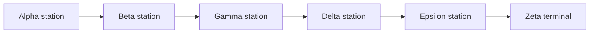

# Wide diagram

```mermaid
flowchart LR
  AlphaStation[Alpha station] --> BetaStation[Beta station] --> GammaStation[Gamma station] --> DeltaStation[Delta station] --> EpsilonStation[Epsilon station] --> ZetaTerminal[Zeta terminal]
```

After the diagram.
